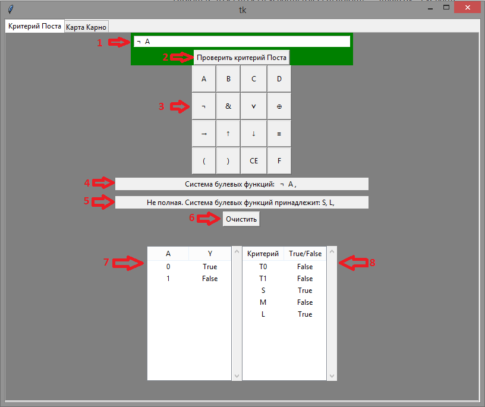

# Diplom

RUN.bat - запуск программы

1. Поле ввода булевой функции.
2. Кнопка, отоброжающая таблицу истинности и результаты проверки критерия Поста.
3. Кнопки:
    1. Переменных (A, B, C, D, F).
    2. Булевых функций
        1. ¬ - Отрицание (НЕ)
        2. & - Конъюнкция (И)
        3. ⋁ - Дизъюнкция (ИЛИ)
        4. ⊕ - Исключающее ИЛИ, сумма по модулю 2 (XOR)
        5. → - Импликация
        6. ↑ - Штрих Шеффера (И-НЕ)
        7. ↓ - Стрелка Пирса (ИЛИ-НЕ)
        8. ≡ - Эквивалентность (РАВНО)
    3. ( ) - Скобки
    4. CE - Очистить поле ввода
     
4. Введёная система булевых функций.
5. Результаты проверки критерия Поста для системы булевых функций.
6. Очистить сохраненые булевые функции.
7. Таблица истинности.
8. Таблица с результатами проверки принадлежности предполнам классам.

## Результаты работы программы

### 1. Критерий Поста
#### 1.1 Для (НЕ A) 

#### 1.2 Для (НЕ A) , (A & B)

### 2. Карта Карно 

